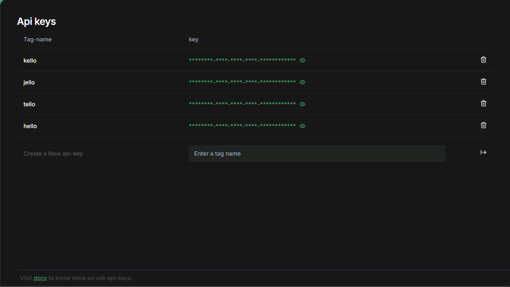

> # Guides 📑

## Creating and Managing Your API Key

To start using the `@RenthubBTFS` SDK, you’ll need an API key. Follow these steps to create and manage your API key:

### 1. Navigate to the Dashboard

1. Go to the RentHub dashboard by visiting [RentHub Dashboard](https://renthub.cloud/app/api).

### 2. Create a New API Key

1. Once you're on the dashboard, look for the API key section.
2. Enter a tag name for your new API key. This tag helps you identify the key later.
3. Click the "OK" button to generate your new API key.

    

   - **Note**: You can create a maximum of 5 API keys at a time.

### 3. Manage Existing API Keys

1. **Delete API Keys**: If you need to remove any existing API keys, you can do so from the same dashboard. Locate the key you wish to delete and clickk on the delete button.

   - **Note**: Ensure that you manage your API keys carefully to maintain security and avoid any disruptions in your service.

